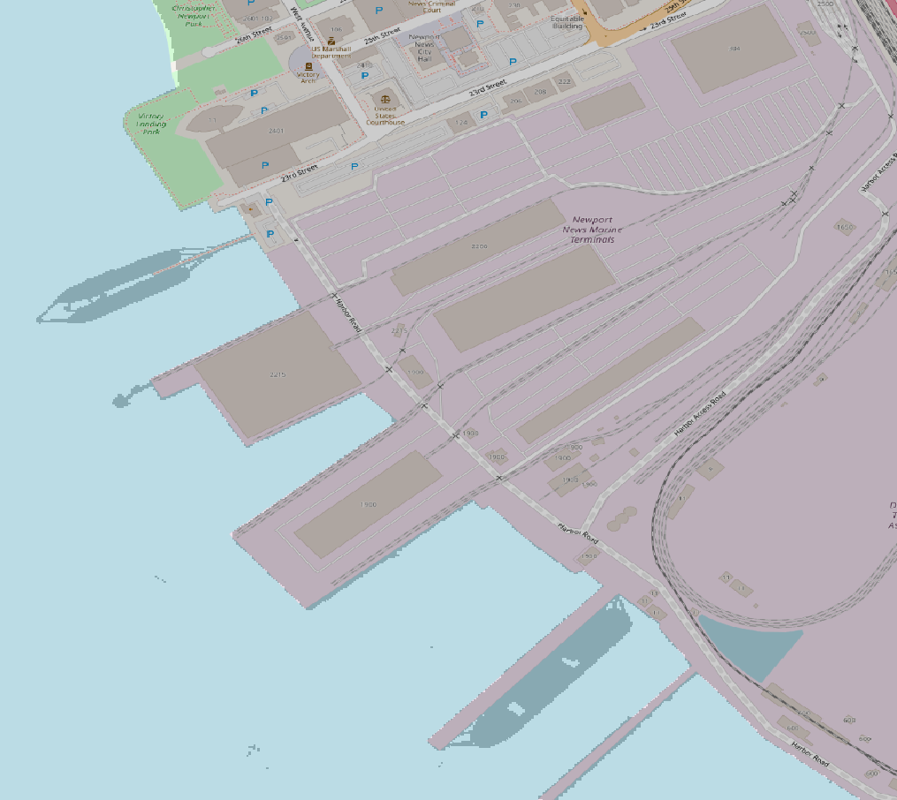

## Newport News Shipbuilding Climate Change Impact Prediction Tool

This repository houses code, documentation, and rubric information for a VCU Capstone Project. Newport News Shipbuilding (NNSB) has prompted us with the task of creating a system that will predict how climate change will impact their operations. The main focus of this tool is the prediction of how various climate factors will impact the Newport News area and in tern impact operations at the ship yard.

Our answer to this challenge was to create this Climate Change Impact Prediction Tool (CCIPT). By factoring in local data gathered all around the southern chesapeake bay region, our system creates several regressive models to predict future climate conditions. These models include analysis on sea level, tide, storm surge, and land subsidence data in the Newport News area. 

## Navigation
* __Code__: Contains scripts used to run CCIPT along with the __Data__ directory.
  * __Data__: Contains csv and sql data that drives the modeling process.
* __Rubrics__: Contains binary files that hold the excel rubrics that evaluate this project. 
* __System Documentation__: Contains all directories regarding documentation.
  * __Diagrams__: Contains all diagrams that map system process, entity relations, and overall design.
  * __Documents__: Contains all documents that depict sponsor related proposals and requirements.
  * __Draw IO Files__: Contains xml files that back the diagrams in the __Diagrams__ directory.
  * __Notes__: Collection of meeting notes taken throughout duration of project.
  * __Sources__: Contains all documents and web addresses used as information insights for climate data.
  * __Status Reports__: Contains all status reports generate by developers for liability purposes.
  * __User Manuals__: Contains all manuals for front end users.
  
## Developers
_Gavin Alberghini_

_Christopher Maybush_

_Daniel Webster_

_Hakizimana Jeanmarie_
